# DailyDone

Este é um projeto Ruby on Rails 8, configurado com PostgreSQL, Hotwire (Turbo + Stimulus) e Devise para autenticação. O projeto utiliza práticas modernas de desenvolvimento Rails, incluindo importmap, cssbundling, Propshaft como pipeline de assets e testes com RSpec.

## ✨ Funcionalidades

- Ruby on Rails 8
- Autenticação com Devise
- PostgreSQL como banco de dados
- Hotwire (Turbo + Stimulus)
- RSpec para testes
- Factory Bot e Shoulda Matchers para testes automatizados
- Importmap para gestão de JavaScript
- Propshaft como asset pipeline
- Configuração de ambiente com dotenv
- Brakeman para análise de segurança
- Rubocop Rails Omakase para linting
- Kamal para deploy com Docker
- Thruster para performance no servidor Puma

## 🛠️ Tecnologias e Gems

- **Rails** ~> 8.0.2
- **PostgreSQL** (pg)
- **Devise** ~> 4.9
- **Hotwire** (turbo-rails + stimulus-rails)
- **Importmap Rails**
- **Propshaft**
- **RSpec Rails**
- **Factory Bot Rails**
- **Shoulda Matchers**
- **Brakeman**
- **Rubocop Rails Omakase**
- **Capybara + Selenium Webdriver** (system tests)
- **Letter Opener + Letter Opener Web** (visualização de emails em dev)
- **dotenv-rails**
- **Kamal** (deploy)
- **Thruster** (performance Puma)
- **Solid Cache, Solid Queue, Solid Cable** (background jobs, cache e websockets)
- **Puma**

## ⚙️ Pré-requisitos

- Rails ~> 8.0.2
- PostgreSQL
- Node.js e Yarn (se for usar JS bundlers além do importmap, por exemplo ESBuild)

## 🚀 Instalação

1. Clone o repositório:

  ```bash
  git clone https://github.com/RicardoCamposJr/todo_v360.git
  cd seu-projeto
  ```
  
2. Instale as dependências:

```bash
bundle install
```

3. Configure as variáveis de ambiente

4. Crie e atualize o banco de dados:
```bash
rails db:create db:migrate
```

5. Rode o servidor:

```bash
bin/dev
```

Acesse: http://localhost:3000

## ✨ Features da plataforma (Telas mais relevantes)

### Boas vindas:
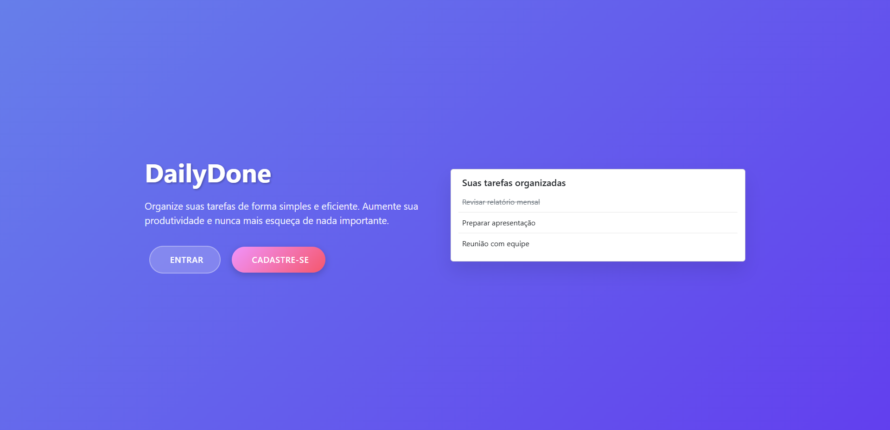
- O intuito dessa página é receber os usuários de maneira intuitiva na plataforma.
- Nela, o usuário pode ser redirecionado para realizar o login ou o cadastro na plataforma.

### Login
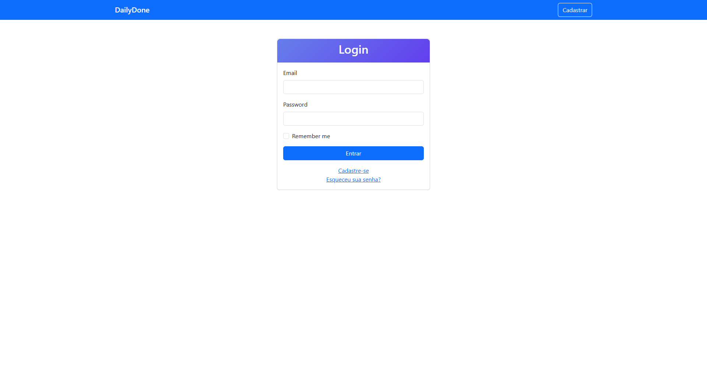
- Aqui, o usuário pode realizar o login na plataforma caso já possua uma conta cadastrada na plataforma.
- Na navbar há um link para retornar à página de boas vindas.
- O usuário pode ser redirecionado à tela de cadastro ou ao fluxo de "Esqueci minha senha", também implementado na plataforma.

### Esqueceu sua senha?
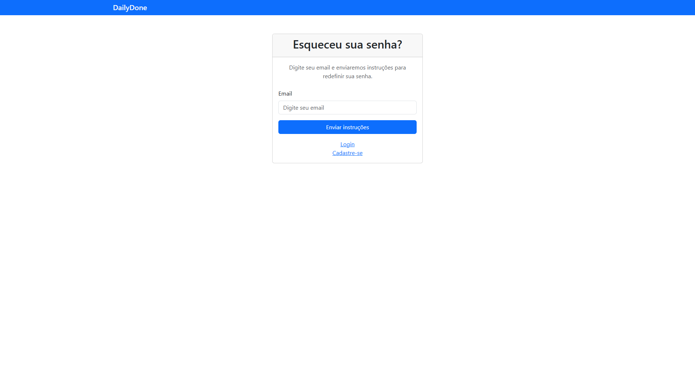
- A plataforma também possui o fluxo de recuperação de senha totalmente funcional.
- O usuário deve informar seu email de cadastro na plataforma e submeter a requisição. Assim, um email de recuperação de senha será enviado ao email de cadastro informado.

### Email de recuperação de senha
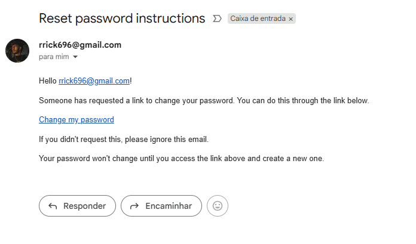
- Este é o email de recuperação de senha enviado ao usuário.
- O usuário deve clicar no link de redirecionamento para a plataforma, prosseguindo com o fluxo.

### Redefinição de senha

- Para completar o fluxo de redefinição de senha, o usuário deve inserir a nova senha para alterá-la.

### Cadastro
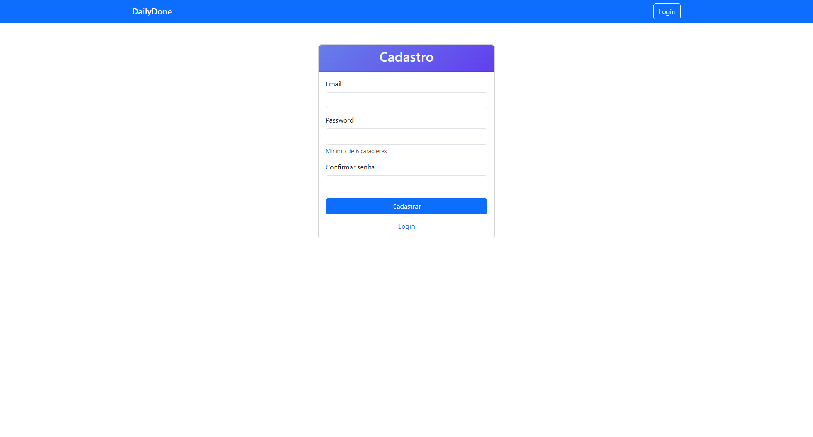
- Aqui o usuário poderá se cadastrar na plataforma, inserindo as informações necessárias.

### Home
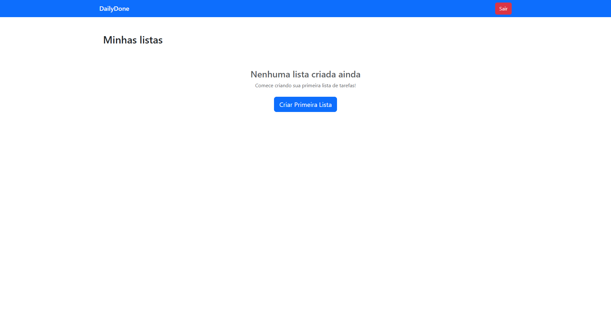
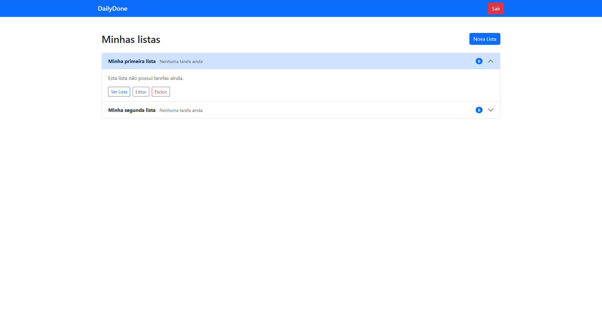
- Ao realizar o login na plataforma, o usuário é redirecionado à tela de Home.
- O usuário pode visualizar todas as listas de afazeres que ele criou na plataforma.
- Caso não tenha listas até o momento, uma mensagem é apresentada.
- O usuário pode: criar uma nova lista; visualizar, editar ou excluir uma lista já criada.

### Visualização da lista vazia
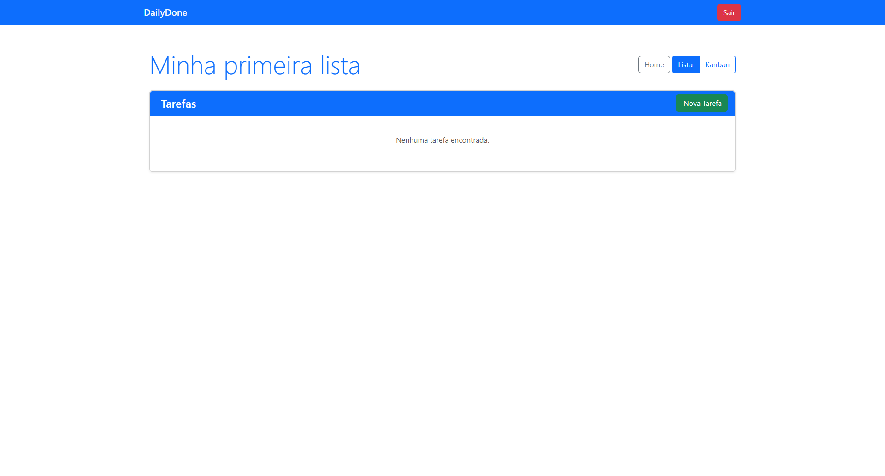
- Aqui o usuário pode: visualizar todas as tarefas de uma lista; criar, editar ou excluir tarefas.
- A plataforma oferece também uma visualização diferente além da listagem, a visualização kanban. É possível alternar entre as visualizações pelo toggle ao lado do botão "Home".

### Lista com tarefas
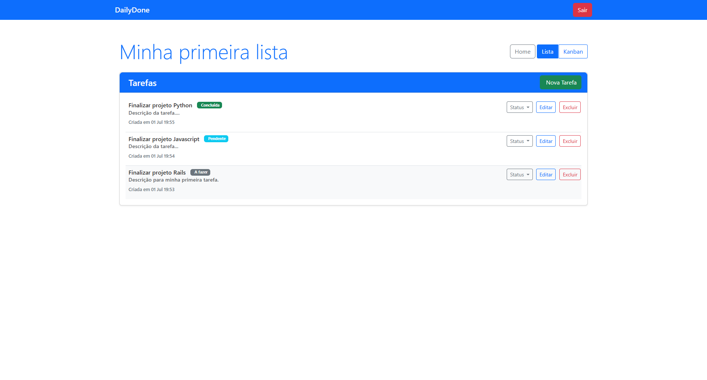
- Acima, uma demonstração de como as listas são apresentadas com tarefas.
- AS tarefas possuem status de "A fazer", "Pendente" e "Concluída".
- É possível alterar os status das tarefas através do dropdown "Status".
- As tarefas mais recentes são apresentadas no topo da lista.

### Visualização kanban
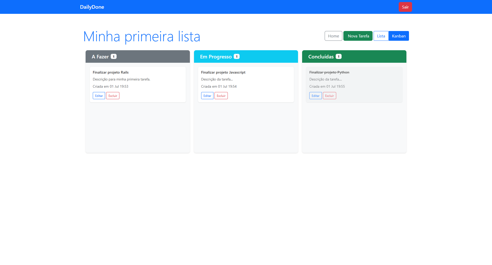
- As listas podem também ser visualizadas em um componente kanban ao clicar no toggle "Kanban".
- No kanban, o usuário pode visualizar suas tarefas em um board dividido em colunas.
- O kanban possui a feature de drag and drop, caso o usuário deseje alterar o status de uma tarefa, basta arrastar o card à coluna referente.
- Os cards também podem ser visualizados de uma melhor maneira através de modais. Assim, ao clicar em uma tarefa, um modal é aberto apresentando as informações daquela tarefa:
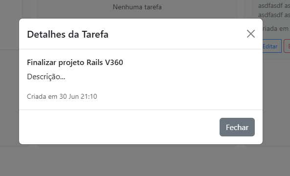

### Observação importante:
A página de visualização de tarefas possui uma lógica envolvendo o localStorage para armazenar a escolha anterior da visualização, assim, a página é reajustada para a escolha de visualização do usuário utilizando valores armazenados em localStorage. Melhorando assim, a experiência do usuário na plataforma.

## 🧪 Rodando os testes
Execute todos os testes com:

```bash
bundle exec rspec
```

## 👤 Autores
Ricardo Campos